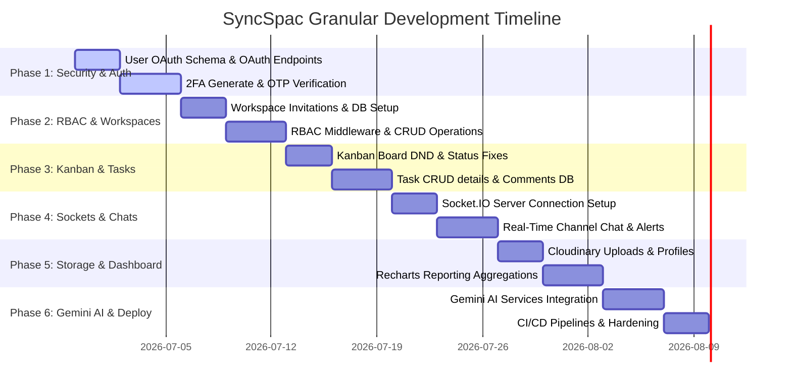

# SyncSpac: Advanced Production-Ready Project Plan & Roadmap

This project plan contains a highly granular 6-week roadmap to build, secure, and deploy SyncSpac—the advanced full-stack AI-powered developer collaboration platform.

---

## 1. Codebase Audit & Gap Analysis

Our analysis of the current codebase reveals several missing components required to meet the high standards of a production collaborative system:

### 1.1 Database Collections Status
- **User Schema**: Active, but needs expansion for Google/GitHub OAuth identifiers (`googleId`, `githubId`), 2FA parameters (`twoFactorSecret`, `isTwoFactorEnabled`, `recoveryCodes`), and user profile avatars.
- **Workspace Schema**: Active, but members list only implements static roles without validation methods.
- **Project Schema**: Active, but lacks indexes and status keys mismatch with KanbanBoard casing (`inProgress` vs `inprogress`).
- **Task Schema**: Active, but lacks due dates, priority tiers, tags, or description editor properties.
- **Comment Schema**: ❌ **Missing**. Needed for task-specific developer discussions.
- **Message Schema**: ❌ **Missing**. Needed to store channel and direct message logs.
- **Notification Schema**: ❌ **Missing**. Needed to log user assignments, deadlines, mentions, and chat notifications.
- **Invitation Schema**: ❌ **Missing**. Needed to generate, track, and secure workspace invite tokens.

### 1.2 Route & Controller Status
- **Auth Service**: Registration & login work via JWT, but forgot password is a dummy controller, and OAuth/2FA modules are completely absent.
- **Workspace Service**: Basic POST `/` and GET `/:id` are routed, but update, delete, member invites, and role updates do not exist.
- **Project Service**: POST `/` is routed, but `getProjectById` is unrouted, and update/delete methods are absent.
- **Task Service**: Basic createTask and updateTaskStatus are routed, but detailed task updates (due dates, assignees, description edits) and delete task are missing.
- **Real-Time Sockets**: ❌ **Missing**. Socket.IO integration is missing on both frontend and backend.
- **Cloudinary Storage**: ❌ **Missing**. No backend routing exists for avatar or attachment file uploads.
- **AI Engine Service**: ❌ **Missing**. No controllers exist to interface with Google Gemini API.

---

## 2. 6-Week Roadmap

### Week 1: Advanced Authentication, OAuth & Two-Factor Authentication (2FA)
*Focus: Harden security controls, integrate Google/GitHub third-party sign-in, and deploy MFA.*

1. **User Schema Upgrade**:
   - Add fields: `googleId`, `githubId`, `twoFactorSecret`, `isTwoFactorEnabled`, `recoveryCodes`.
2. **OAuth Sign-in**:
   - Implement backend passport-based or custom redirect routes for Google & GitHub OAuth.
   - Set up callback screens on the frontend React app to extract JWTs and store them.
3. **MFA Modules**:
   - Use `otplib` and `qrcode` to generate OTP codes and return interactive QR codes.
   - Build `/api/auth/2fa/generate` (for QR codes), `/api/auth/2fa/verify` (validates code and enables 2FA), and `/api/auth/2fa/disable`.
   - Update user login flow: if `isTwoFactorEnabled` is true, return a temporary token prompting user for a 2FA OTP verification code before granting session.
4. **Session Control**:
   - Migrate token transfers to HttpOnly Cookies for cross-site script request security.

### Week 2: Collaborator Management, Roles & Workspace/Project CRUD
*Focus: Secure workspaces via RBAC and handle invitations safely.*

1. **DB collections**:
   - Implement `Invitation` schema logging `email`, `workspaceId`, `role` (admin/member/guest), cryptographic sign token, and expiration.
2. **Invite Engine**:
   - Endpoint `/api/workspace/invite` generates unique tokens and dispatches emails via `nodemailer`.
   - Endpoint `/api/workspace/accept` validates tokens and appends users to Workspace `members` array.
3. **RBAC middleware**:
   - Create `checkRole(['admin', 'member'])` middleware checking Workspace members role maps prior to controller operations.
4. **Workspace & Project CRUD**:
   - Add backend routes for workspace update/deletion.
   - Complete project routes for update, deletion, and getWorkspaceProjects (retrieves projects under a workspace).

### Week 3: Interactive Kanban drag-and-drop, Tasks CRUD & Comments
*Focus: Deliver interactive boards and complete task metadata operations.*

1. **Comments System**:
   - Create `Comment` database model.
   - Write controllers for `addComment`, `getTaskComments`, and `deleteComment`.
2. **Tasks expansion**:
   - Add fields: `dueDate`, `priority` (low/medium/high), `assignedTo`.
   - Write `/api/tasks/:id` GET, PUT (updates title, description, priority, due dates, assignee), and DELETE endpoints.
   - Implement tasks paginated query search supporting filters (priority, status, date) and keyword matching.
3. **Kanban Board drag-and-drop**:
   - Align casing: Fix `inprogress` vs `inProgress` discrepancies.
   - Integrate `@hello-pangea/dnd` for smooth column re-orderings and board card updates.
   - Implement optimistic UI updates on drag drop events.

### Week 4: Real-time Socket.IO Sync, Group Channels & Live Feed
*Focus: Connect socket channels to sync live chat messages and board state updates.*

1. **Socket.IO configuration**:
   - Spin up Socket.IO server inside backend `server.ts`.
   - Build frontend socket context lifecycle. Store maps between connected sockets and `userId`s.
2. **Namespaces / Rooms**:
   - Join client sockets to `workspace_[id]` or `project_[id]` rooms.
3. **Real-time Broadcasts**:
   - Chat: Broadcast socket event `new_message` to project channels.
   - Kanban Board: Broadcast `board_updated` on card re-orders.
   - Notifications: Emit direct socket events for assignments, mentions, and due reminders.
4. **Chat Drawer**:
   - Build a collapsible side panel inside projects page showcasing live message threads.

### Week 5: Cloudinary Uploads, Analytics Dashboards & Task Queries
*Focus: Handle file assets and render visual dashboards.*

1. **Multer & Cloudinary Storage**:
   - Setup `multer-storage-cloudinary` on backend.
   - Hook attachment routes `/tasks/:id/attachments` and avatar uploads `/user/profile/avatar`.
2. **Aggregation Analytics**:
   - Write MongoDB aggregation pipelines (`$group`, `$facet`) querying completions, backlogs, priorities, and workload.
3. **Recharts Integration**:
   - Render dashboard performance stats on frontend using AreaCharts (completion velocity) and BarCharts (priorities/workload).

### Week 6: Google Gemini AI Integration & DevOps Deployment
*Focus: Integrate AI developer helpers, secure CORS, package Docker, and configure CI/CD pipelines.*

1. **Google Gemini Services**:
   - Integrate `@google/generative-ai` SDK.
   - Create `/api/ai/task-summary` (summarize issues).
   - Create `/api/ai/explain-bug` (parse crash dumps and output markdown resolutions).
   - Create `/api/ai/sprint-suggest` (analyze backlogs).
   - Create `/api/ai/meeting-notes` (generate issues from raw chat threads).
2. **Hardening**:
   - Install `helmet` and set up strict CORS whitelists.
   - Wire `express-rate-limit` to block brute force attempts on login/register endpoints.
3. **DevOps / CI/CD**:
   - Write multi-stage production build `Dockerfile`.
   - Setup GitHub Actions configuration files mapping automated test steps and automated deployments to Vercel and Render.
